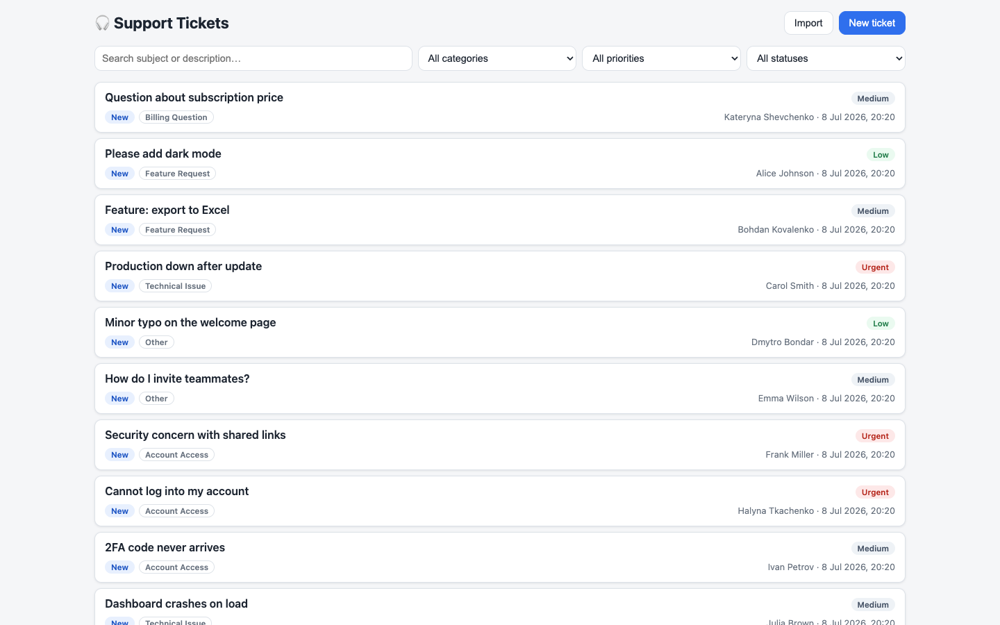
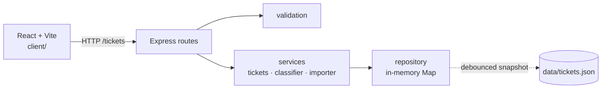

# 🎧 Homework 2: Intelligent Customer Support System

> **Student Name**: ash ([@overgapo](https://github.com/overgapo))
> **Date Submitted**: 2026-07-12
> **AI Tools Used**: Claude Code (Fable 5) — spec analysis, implementation, tests, docs

---

## 📋 Project Overview

A customer support ticket management system built for the AI-Assisted Development course:

- **REST API** (Node.js 18+ / Express) — ticket CRUD with filtering and free-text search, bulk import from **CSV / JSON / XML** with **all-or-nothing** semantics, structured validation errors.
- **Auto-classification** — a deterministic keyword engine assigns one of six categories and a priority, with a confidence score (0–1), human-readable reasoning, and matched keywords; manual values always win over automation.
- **React front-end** (Vite) — ticket list with combinable filters, create/edit forms with client-side validation, detail view with the classification breakdown, file import dialog, one-click auto-classify.
- **Persistence without a database** — in-memory store behind a repository abstraction, with a debounced JSON snapshot that survives restarts.
- **77 tests, ~95% line coverage** (gate: 85%): unit, API, integration, performance benchmarks, HTTP e2e, plus a browser-level UI suite (puppeteer) covering rendering, dialogs, and error paths.



<details>
<summary>📸 More screenshots (all use cases)</summary>

| Screenshot | Shows |
|------------|-------|
| [ui.png](docs/screenshots/ui.png) | Main ticket list with 100 imported, auto-classified tickets |
| [ui_filters_combined.png](docs/screenshots/ui_filters_combined.png) | Combined filtering: category=Account Access + priority=Urgent |
| [ui_detail_classification.png](docs/screenshots/ui_detail_classification.png) | Detail view with the classification block (confidence, reasoning, keywords) |
| [ui_form_validation.png](docs/screenshots/ui_form_validation.png) | Create form blocked by client-side validation errors |
| [ui_import_success.png](docs/screenshots/ui_import_success.png) | Bulk import success (30/30 XML records) |
| [ui_import_atomic_error.png](docs/screenshots/ui_import_atomic_error.png) | All-or-nothing import rejection with per-record errors |
| [ui_autoclassify_toast.png](docs/screenshots/ui_autoclassify_toast.png) | One-click auto-classification with result feedback |
| [ui_mobile.png](docs/screenshots/ui_mobile.png) | Responsive single-column layout (390 px viewport) |
| [test_coverage.png](docs/screenshots/test_coverage.png) | Jest coverage report (~95% lines) |

</details>

## 🏗️ Architecture



Layering: routes (HTTP) → services (domain) → repository (storage). Full detail, diagrams, and design trade-offs: [docs/ARCHITECTURE.md](docs/ARCHITECTURE.md).

## 🚀 Installation & Setup

```bash
./demo/run.sh   # installs, builds, starts, and seeds 100 sample tickets
```

Then open **http://localhost:3000**. Manual steps and Windows instructions: [HOWTORUN.md](HOWTORUN.md).

## 🧪 Running Tests

```bash
npm install
npm test                # 66 tests across 11 suites (~1s)
npm run test:coverage   # enforces the ≥85% lines/statements gate
npm run test:ui         # 11 browser UI tests via puppeteer (needs local Chrome)
```

Coverage report: `coverage/lcov-report/index.html` (screenshot: [docs/screenshots/test_coverage.png](docs/screenshots/test_coverage.png)). Full guide: [docs/TESTING_GUIDE.md](docs/TESTING_GUIDE.md).

## 📁 Project Structure

```
homework-2/
├── src/                  # Express backend
│   ├── app.js            # app factory (DI for tests) + static client serving
│   ├── server.js         # entry point
│   ├── routes/           # HTTP layer
│   ├── services/         # ticket construction, classifier, importer
│   ├── repository/       # in-memory store + JSON snapshot
│   ├── validation/       # single source of validation truth
│   └── config/           # enums & classification keyword tables
├── client/               # React + Vite front-end
├── tests/                # Jest + supertest (fixtures in tests/fixtures/)
├── demo/                 # run scripts, sample data (50/20/30), .http requests
└── docs/                 # SPEC, PLAN, API_REFERENCE, ARCHITECTURE, TESTING_GUIDE
```

## 📐 Documentation Map

| Document | Audience |
|----------|----------|
| [docs/SPEC.md](docs/SPEC.md) | The binding resolved specification (assignment + decisions closing its gaps; deviations listed at the end) |
| [docs/API_REFERENCE.md](docs/API_REFERENCE.md) | API consumers — endpoints, schemas, cURL examples |
| [docs/ARCHITECTURE.md](docs/ARCHITECTURE.md) | Technical leads — diagrams, decisions, trade-offs |
| [docs/TESTING_GUIDE.md](docs/TESTING_GUIDE.md) | QA — test pyramid, benchmarks, manual checklist |
| [HOWTORUN.md](HOWTORUN.md) | Anyone running the project |

## 🤖 How AI Was Used

The project was built end-to-end in a spec-first workflow with Claude Code:

1. **Spec hardening** — the assignment (`TASKS.md`) was analyzed for gaps and contradictions (~16 found, from a "5 documents" typo to undefined import semantics); each was resolved as an explicit decision and recorded in [docs/SPEC.md](docs/SPEC.md), with deliberate deviations documented.
2. **Phased implementation** — [docs/PLAN.md](docs/PLAN.md) defines 11 dependency-ordered phases, each with a completion gate (tests green, curl pass, coverage threshold); the AI worked through them autonomously, recording new decisions back into the SPEC as they arose.
3. **Tests alongside code** — each feature phase shipped with its test files; coverage grew with the code instead of being backfilled.
4. **Verification beyond tests** — the UI was exercised in a real browser (form validation, filters, classification display) before being declared done.

Screenshots of the AI workflow: [docs/screenshots/](docs/screenshots/).

---

<div align="center">

*This project was completed as part of the AI-Assisted Development course.*

</div>
