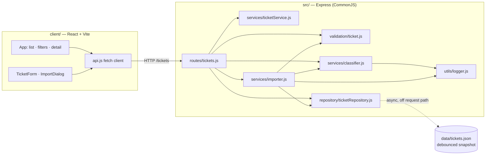
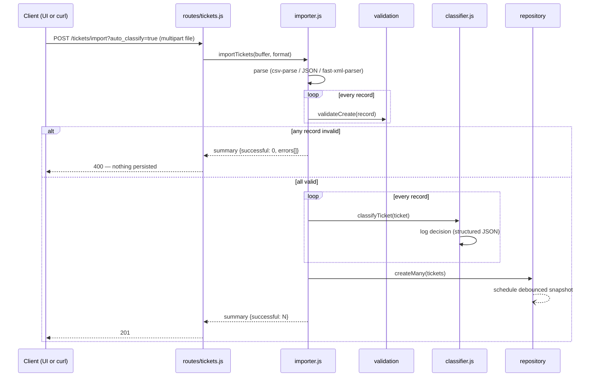

# Architecture

Technical overview for the Intelligent Customer Support System. The binding functional contract lives in [`SPEC.md`](SPEC.md); this document explains how the implementation is put together and why.

## High-level view

Layering rule: **routes → services → repository**. Routes do HTTP concerns only; services hold domain logic; the repository is the single owner of storage. Nothing outside `ticketRepository.js` knows how tickets are stored — swapping the Map for SQLite would touch one file.

## Components

| Component | Responsibility |
|-----------|----------------|
| `routes/tickets.js` | HTTP wiring: status codes, query parsing, multipart upload (multer, in-memory, 5 MB limit) |
| `validation/ticket.js` | Single source of validation truth for create/update **and** every import format; returns `{errors, value}` with a sanitized value; silently strips server-managed fields |
| `services/ticketService.js` | Ticket construction (UUID, timestamps, defaults) and update semantics (partial merge, `resolved_at` transitions, `overridden` flag on manual changes) |
| `services/classifier.js` | Rule-based classification: keyword tables in `config/classificationRules.js`, deterministic confidence, structured decision logging |
| `services/importer.js` | Format detection, CSV/JSON/XML parsers normalizing to one record shape, two-pass all-or-nothing import |
| `repository/ticketRepository.js` | In-memory `Map` CRUD + filtering + debounced JSON snapshot |
| `config/` | Enums and keyword tables — data, not logic; tuning the classifier means editing a table |

## Data flow: bulk import with auto-classification

## Design decisions & trade-offs

1. **In-memory storage + JSON snapshot.** Zero dependencies and instant startup for reviewers; data still survives restarts. The snapshot write is debounced (100 ms), asynchronous, and atomic (tmp file + rename) — it never blocks a request. Trade-off: a crash inside the debounce window can lose ≤100 ms of writes; acceptable here.
2. **All-or-nothing import** (deliberate deviation from the assignment's partial-success reading — see SPEC "Deviations"). Two-pass design: validate everything, then insert everything. Trade-off: one bad row blocks 49 good ones — but the error report tells the user exactly what to fix, and partial imports would leave datasets half-loaded with no undo.
3. **Rule-based classifier, not ML.** Keyword tables give deterministic, explainable, instantly testable results (`reasoning` and `keywords` come free). Confidence = `matches/(matches+competing)` clamped to [0.3, 0.95] — ambiguity between categories directly lowers the score.
4. **Manual wins over automation.** Auto-classification never overwrites values a human supplied (per-field); the explicit `/auto-classify` endpoint is the only path that force-applies. Prevents silent churn of agent decisions.
5. **Validation returns a sanitized value.** Routes never touch `req.body` directly — the whitelist approach makes mass-assignment of server-managed fields (`id`, `created_at`, `classification`…) structurally impossible.
6. **App factory (`createApp({repository})`).** Dependency injection keeps tests hermetic (fresh repository per test, no port binding via supertest) and is the reason the suite runs in ~1 s.

## Security considerations

- Strict field whitelisting on input; server-managed fields cannot be set by clients.
- Upload limits: 5 MB, memory storage, parsed synchronously — no files ever hit disk.
- Enum validation on query filters prevents junk reaching the repository.
- React escapes all rendered content by default (no `dangerouslySetInnerHTML` anywhere).
- No auth: out of scope for the assignment; the API must not be exposed publicly as-is.

## Performance considerations

- All operations are in-memory; measured medians are 1–3 ms for the heaviest endpoints (see [TESTING_GUIDE.md](TESTING_GUIDE.md) benchmarks).
- List filtering is O(n) over a `Map` — fine to tens of thousands of tickets; the repository boundary is where an index or SQLite would slot in.
- Node's single-threaded event loop makes Map mutations atomic per request — the 20-concurrent-requests scenario needs no locking.
- Snapshot writes are debounced and off the request path by design.
