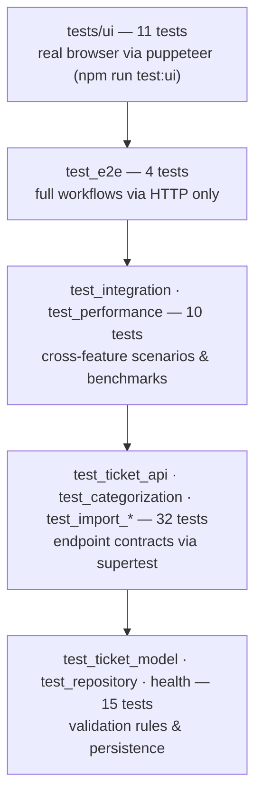

# Testing Guide

How the test suite is organized, how to run it, and what the benchmarks show. Written for QA engineers picking up the project.

## Test pyramid



66 tests across 11 suites in the main run (~1 s: every suite gets a fresh in-memory repository via the `createApp({repository})` factory — no port binding, no disk I/O), plus 11 browser-level UI tests in a separate suite (~7 s).

## Running tests

```bash
npm test                 # main suite (unit/API/integration/e2e)
npm run test:watch       # watch mode
npm run test:coverage    # suite + coverage report and gate
npm run test:ui          # browser UI tests (needs a local Chrome)
npx jest test_import_csv # single suite
npx jest -t "all-or-nothing"  # tests matching a name
```

**Browser UI suite** (`tests/ui/`, `jest.ui.config.js`): spawns the real server on port 3100 (snapshot disabled), drives a headless Chrome through puppeteer-core, and covers what HTTP tests can't — rendering, client-side validation, dialogs, toasts, and the unreachable-API error path. It looks for Chrome in the standard install locations (override with `CHROME_PATH`) and **skips itself** when no browser is found, so CI without Chrome stays green. It is intentionally excluded from `npm test` and the coverage gate.

The coverage gate (jest.config.js) **fails the run** below 85% lines/statements. Current: ~95% lines, ~94% statements, ~98% functions. The HTML report lands in `coverage/lcov-report/index.html`; a screenshot is committed at [`screenshots/test_coverage.png`](screenshots/test_coverage.png).

## Test data

| Location | Contents |
|----------|----------|
| `tests/fixtures/` | Minimal valid/invalid CSV, JSON, XML files used by the import suites |
| `demo/sample_tickets.{csv,json,xml}` | Realistic datasets (50/20/30 records) exercising every category and priority |
| `demo/invalid_tickets.{csv,json,xml}` | Mixed valid+broken records for negative demos of the all-or-nothing import |
| `demo/generate-samples.js` | Deterministic generator for all of the above (`node demo/generate-samples.js`) |

## Performance benchmarks

Thresholds are asserted by `tests/test_performance.test.js`; measured values are medians on a local Apple Silicon machine (Node 20, `NODE_ENV=test`).

| Benchmark | Threshold | Measured (median) |
|-----------|-----------|-------------------|
| Create a single ticket | < 50 ms | ~0.9 ms |
| List 1000 tickets | < 200 ms | ~2.8 ms |
| Import 100 CSV records (+ classification) | < 2 s | ~2.3 ms |
| Classify one ticket | < 20 ms | ~0.004 ms |
| 20 concurrent mixed requests | < 3 s total | ~7 ms |

Thresholds are deliberately generous (SPEC §6): they exist to catch order-of-magnitude regressions, not to flake on a slow CI runner.

## Manual testing checklist

Start the app with seeded data first: `./demo/run.sh`, then open http://localhost:3000.

- [ ] Ticket list loads with 100 tickets, newest first
- [ ] Category / priority / status dropdowns filter the list (combinable)
- [ ] Search box narrows results by subject/description text
- [ ] Clicking a ticket opens the detail panel with the classification block (confidence bar, reasoning, keywords)
- [ ] "New ticket" with an invalid email shows an inline error and does not submit
- [ ] Creating with "Auto-classify" checked picks category/priority automatically
- [ ] Edit form pre-fills values; saving updates the list and detail panel
- [ ] Status change to Resolved sets "Resolved" timestamp; back to In Progress clears it
- [ ] Auto-classify button reclassifies and clears the "overridden" badge
- [ ] Import dialog with `demo/sample_tickets.xml` reports 30/30 imported
- [ ] Import dialog with `demo/invalid_tickets.csv` reports per-record errors and imports nothing
- [ ] Delete asks for confirmation and removes the ticket
- [ ] Restart the server — tickets are still there (snapshot restore)
- [ ] Narrow the window to ~375 px — layout stays usable (single column)
